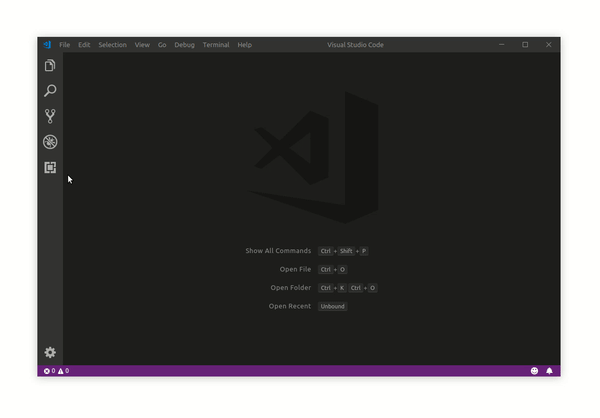
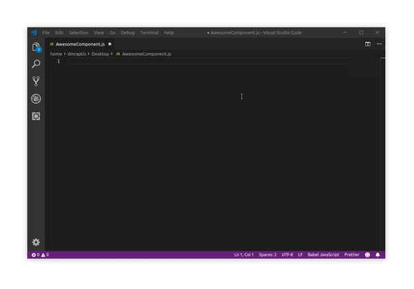

# vscode-react-snippets

A curated list of useful ReactJs snippets that can skyrocket your development time and productivity 🧠

## 🔌 Installation

1. Open **File** menu
2. Select **Preferences > User Snippets**
3. Type **Javascript Babel** (Javascript React is an option too, but it requires .jsx file conversion)
4. Add your snippet and save the file

You're ready to use your awesome snippet 💪

## ✍ Usage

1. Type the prefix you defined earlier
2. Choose your snippet and press **TAB**
3. Navigate through your snippet variables by pressing **TAB** again

